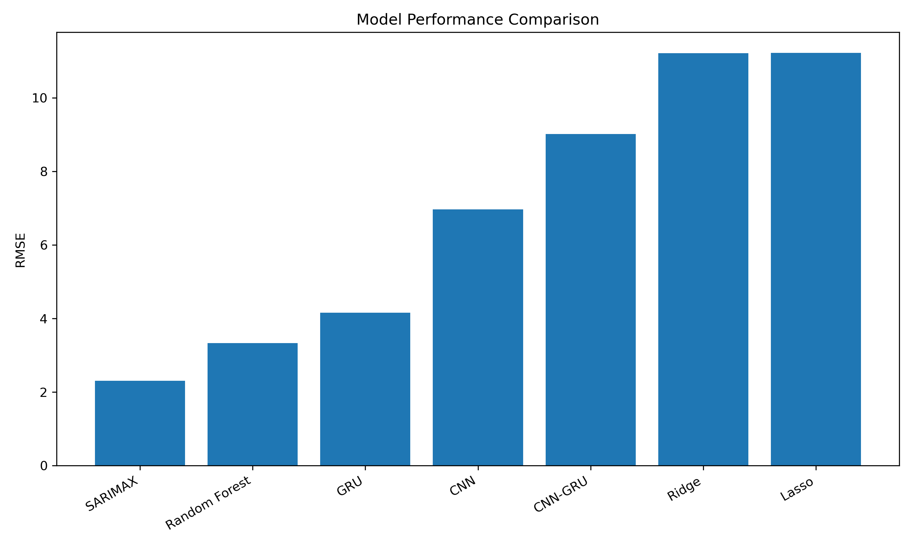

# Soybean Climate Yield Prediction

## Overview

This project investigates soybean yield prediction using historical climate and environmental data.

The analysis uses monthly observations and combines time-series analysis, machine learning, and deep learning approaches to model soybean yield.

The main target variable is `Soybean_Yield`.

## Dataset

The dataset contains 420 monthly observations and 11 columns:

- `Date`
- `Year`
- `Month`
- `Rainfall_mm`
- `Temperature_C`
- `Humidity_%`
- `Soil_Moisture`
- `Extreme_Weather`
- `Drought_Stress`
- `Heat_Stress`
- `Soybean_Yield`

The raw dataset is located at:

```text
data/raw/soybean_climate_large_test_dataset.csv
```

## Data Preparation and Feature Engineering

The analysis includes:

- Conversion of the `Date` column to datetime format
- Monthly time indexing
- Enforcement of monthly continuity
- Missing-value checks and handling
- Lag features for 1, 3, and 12 months
- Rolling statistical features using 3- and 6-month windows
- Expanding statistical features
- Monthly cyclical features using sine and cosine encoding
- Augmented Dickey-Fuller (ADF) stationarity testing
- Differencing where required for time-series modelling
- Time-based train-test splitting

The main SARIMAX and machine-learning comparison uses an 80/20 time-based train-test split.

## Models

The notebook evaluates:

- ARIMA
- SARIMAX
- Ridge Regression
- Lasso Regression
- Random Forest
- CNN
- GRU
- ARIMA + GRU
- CNN + GRU

## Evaluation Metrics

The models are evaluated using:

- Mean Absolute Error (MAE)
- Mean Squared Error (MSE)
- Root Mean Squared Error (RMSE)
- R²

## Model Comparison

| Model | MAE | MSE | RMSE | R² |
|---|---:|---:|---:|---:|
| SARIMAX | 1.901707 | 5.322217 | 2.306993 | 0.957402 |
| Random Forest | 2.668616 | 11.114291 | 3.333810 | 0.911043 |
| GRU | 3.245447 | 17.304502 | 4.159868 | 0.862319 |
| CNN | 5.955779 | 48.477571 | 6.962584 | 0.614293 |
| CNN-GRU | 7.350789 | 81.273712 | 9.015193 | 0.353354 |
| Ridge | 9.501811 | 125.721428 | 11.212557 | 0.010938 |
| Lasso | 9.516283 | 125.900444 | 11.220537 | 0.009530 |

## Model Performance Visualization

The chart below compares the RMSE of the evaluated models. Lower RMSE indicates lower prediction error.



## Project Structure

```text
soybean-climate-yield-prediction/
├── README.md
├── data/
│   ├── processed/
│   └── raw/
│       └── soybean_climate_large_test_dataset.csv
├── notebooks/
│   └── soybean analysis.ipynb
├── results/
│   ├── figures/
│   └── tables/
└── src/
```

## Notebook

The main analysis is contained in:

```text
notebooks/soybean analysis.ipynb
```

The notebook contains data preparation, feature engineering, time-series analysis, model development, forecasting, and model evaluation.

## Setup and Usage

Clone the repository and install the required dependencies:

```bash
git clone https://github.com/ojwangmaxwell3-ux/soybean-climate-yield-prediction.git
cd soybean-climate-yield-prediction
pip install -r requirements.txt
```

The main analysis notebook is located at:

```text
notebooks/soybean analysis.ipynb
```

Open the notebook using Jupyter Notebook or JupyterLab and run the cells sequentially.

The raw dataset is stored in:

```text
data/raw/soybean_climate_large_test_dataset.csv
```

## Technologies Used

- Python
- Pandas
- NumPy
- Scikit-learn
- Statsmodels
- TensorFlow / Keras
- Matplotlib


## Author

**Maxwel Odhiambo**

Actuarial Science Student | Data Science & Artificial Intelligence
